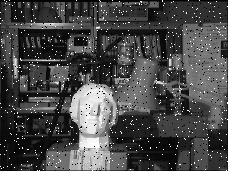

# Loopy Belief Propagation for Image Denoising
A C++ implementation of Loopy Belief Propagation for image denoising. It uses the "min-sum" variation of the algorithm and the "Accelerated" (Right-Left-Down-Up pass) message update schedule.

## Input Image
The noisy image that used as input.

   

## Output Image
The denoised image that created at the output.

   

